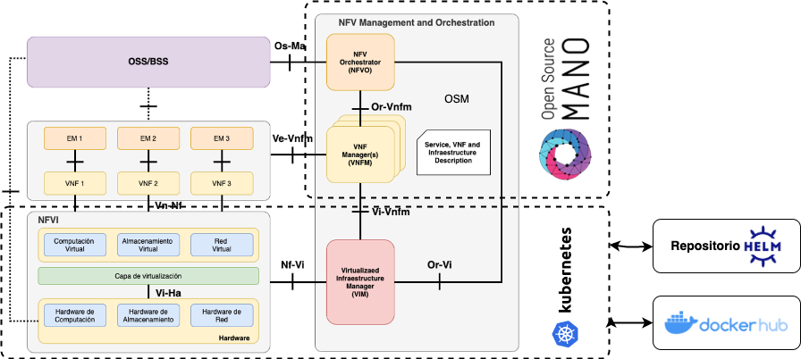
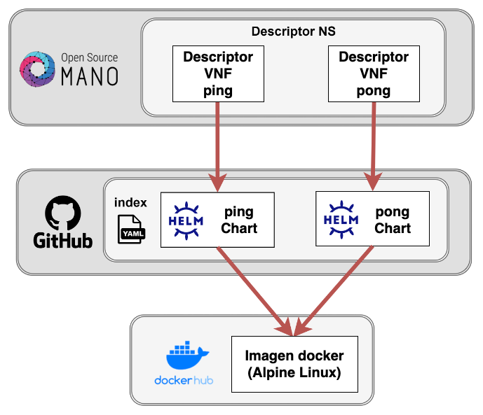
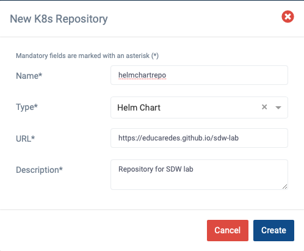
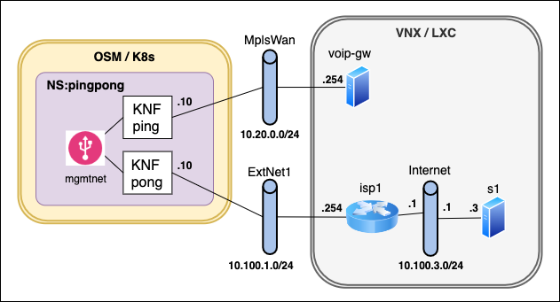

<!-- omit from toc -->
SDW Caso práctico 2: Plataforma de orquestación de servicios basados en NFV
===========================================================================

- [Resumen](#resumen)
- [Entorno](#entorno)
- [Desarrollo de la práctica](#desarrollo-de-la-práctica)
  - [1. Instalación del entorno](#1-instalación-del-entorno)
  - [2. Definición OSM del clúster k8s y configuración de red](#2-definición-osm-del-clúster-k8s-y-configuración-de-red)
  - [3. Familiarización con la GUI de OSM](#3-familiarización-con-la-gui-de-osm)
  - [4. Repositorio de helm charts](#4-repositorio-de-helm-charts)
  - [5. Instalación de descriptores en OSM](#5-instalación-de-descriptores-en-osm)
  - [6. (P) Análisis de descriptores](#6-p-análisis-de-descriptores)
  - [7. Creación de instancias del servicio](#7-creación-de-instancias-del-servicio)
  - [8. Comprobación de los pods arrancados](#8-comprobación-de-los-pods-arrancados)
  - [9. (P) Acceso a los pods ya arrancados](#9-p-acceso-a-los-pods-ya-arrancados)
  - [10. (P) Conexiones externas](#10-p-conexiones-externas)
  - [11. Escenario de la red "real"](#11-escenario-de-la-red-real)
  - [12. (P) Pruebas de conectividad desde los pods](#12-p-pruebas-de-conectividad-desde-los-pods)
  - [13. (P) Conclusiones](#13-p-conclusiones)
- [Anexo I - Comandos](#anexo-i---comandos)

# Resumen

En esta práctica, se va a profundizar en las funciones de red virtualizadas
(VNF) y su orquestación a través de la plataforma de código abierto [Open Source
MANO (OSM)](https://osm.etsi.org). Se va a ver cómo se despliegan funciones de
red virtualizadas mediante OSM a través de ejemplos que permitan entender
distintos procesos, como la creación de VNFs, la preparación de las plantillas
para VNFs y servicios de red y la carga (_onboarding_) de los servicios de red y
sus VNFs en este tipo de plataformas NFV.

# Entorno

La Figura 1 representa el entorno en el que se va a desarrollar la práctica, mostrando su relación con la arquitectura NFV definida por ETSI. Como plataforma de gestión de VNFs se utilizará la plataforma de referencia de ETSI, Open Source Mano (OSM), que, como se ha visto en la teoría, comprende los dos niveles superiores del MANO: el NFVO para gestionar el ciclo de vida de los servicios de red (NS); y el VNFM para gestionar el ciclo de vida de las funciones de red (VNF). Como Virtualized Infrastructure Manager (VIM) se va a utilizar un clúster de Kubernetes, que permite el despliegue de VNFs como contenedores, habitualmente denominados KNFs.
<p align="center">

<br>
Figura 1
</p>
Kubernetes es una plataforma de código libre diseñada para el despliegue de aplicaciones basadas en contenedores. Proporciona múltiples funciones de escalabilidad, resistencia a fallos, actualizaciones y regresiones progresivas, etc. que la hacen muy adecuada para el despliegue de VNFs. Kubernetes incluye su propio gestor de paquetes, denominado Helm, que define la forma de crear y operar repositorios en los que se almacenan los denominados Charts (paquetes en terminología Helm). Básicamente, un Chart define un conjunto de recursos de Kubernetes (contenedores, balanceadores, etc.) que se pueden posteriormente desplegar sobre un clúster de Kubernetes. Adicionalmente, las imágenes de los contenedores usados por Kubernetes suelen almacenarse en repositorios privados o, más comúnmente, en el repositorio oficial de Docker denominado DockerHub.  
<br> 
En la Figura 2 se aprecia con más detalle la relación entre las distintas plataformas y repositorios involucrados en la práctica, que consistirá en el despliegue de un servicio de red sencillo (pingpong) compuesto por dos VNFs interconectadas a través de una red virtual. Para desplegar dicho servicio se proporcionan los descriptores del servicio y de las dos VNFs que lo componen, escritos en YAML de acuerdo a las especificaciones de OSM. 
<p align="center">

<br>
Figura 2
</p>
Los descriptores de las VNFs internamente hacen referencia a dos Chart de Kubernetes en los que se definen los detalles de implementación de las VNFs (imagen, recursos de memoria y CPU, etc.). Estos Chart están almacenados en un repositorio Helm previamente creado en GitHub. A su vez los Chart hacen referencia a una imagen de contenedor basada en Alpine Linux que está almacenada en DockerHub.

A grandes rasgos, la práctica consistirá en la:
o	Carga de los descriptores de NS y VNFs en la plataforma OSM.
o	Configuración en OSM del acceso al repositorio Helm en el que se encuentran los Chart asociados a las VNFs.
o	Creación de una instancia del servicio y comprobación de su funcionamiento.
o	Conexión de las VNFs con sistemas externos a la plataforma NFV

Todo ello con el objetivo de comprender el funcionamiento de un escenario limitado pero realista de NFVs.

Para facilitar la tarea del estudiante, se utilizará la misma máquina virtual
VirtualBox de la anterior actividad práctica, en la que ya está instalado y
configurado todo el software necesario, por lo que no es necesario volver a
descargarla. La máquina ya tiene instaladas todas las herramientas necesarias,
principalmente:

- la infraestructura de NFV (NFVI) que va a ser controlada por OSM, implementada
  mediante el paquete _microk8s_, que proporcionará la funcionalidad de un
  clúster de Kubernetes (k8s),
- scripts en la carpeta ~/bin para facilitar la gestión del entorno

Esta máquina tendrá conectividad con un servidor OSM instalado en la
infraestructura de laboratorios del DIT, a través de una red privada virtual
creada mediante la herramienta _tinc_. 

# Desarrollo de la práctica
## 1. Instalación del entorno

Para realizar la práctica debe utilizar la misma máquina virtual de la práctica 
anterior. Antes de arrancar la máquina, utilice la opción de configuración de
_Carpetas Compartidas_ para compartir una carpeta de su equipo con la máquina
virtual permanentemente, con punto de montaje `/home/upm/shared`. Asegúrese
además de configurar 4096 MB de memoria y 2 CPUs. 

A continuación, arranque la máquina,  abra un terminal y descargue en el
directorio compartido el repositorio de la práctica: 

```
cd ~/shared
git clone https://github.com/educaredes/sdw-lab.git
cd sdw-lab
```

>**Nota:**
>Si ya lo ha descargado antes puede actualizarlo con:
>
>```
>cd ~/shared/sdw-lab
>git pull
>```

Instale la red privada virtual con el servidor OSM mediante:

```
cd ~/shared/sdw-lab/bin
./install-tun <letra>
```

>**Nota:**
>El profesor asignará una \<letra\> a cada alumno de forma
>que cada clúster de k8s gestionado por el OSM central tenga una dirección IP
>distinta.

Compruebe que se ha establecido el túnel haciendo ping al servidor OSM:

```
ping 10.11.12.1
```

## 2. Definición OSM del clúster k8s y configuración de red 

Configure el entorno para acceder a OSM con su nombre de usuario y para
registrar su cluster k8s mediante:

```
cd ~/shared/sdw-lab/bin
./prepare-osmlab <letter> 
```

A continuación, **cierre el terminal** y abra uno nuevo.

En el nuevo terminal, obtenga los valores asignados a las diferentes variables
configuradas para acceder a OSM (OSM_*) y el identificador del _namespace_ de
K8S creado para OSM (OSMNS):

```
echo "-- OSM_USER=$OSM_USER"
echo "-- OSM_PASSWORD=$OSM_PASSWORD"
echo "-- OSM_PROJECT=$OSM_PROJECT"
echo "-- OSM_HOSTNAME=$OSM_HOSTNAME"
echo "-- OSMNS=$OSMNS"
```

## 3. Familiarización con la GUI de OSM

Acceda a OSM desde la máquina virtual mediante:

```
# Acceso a OSM desde la máquina virtual
firefox 10.11.12.1 &
```

Familiarícese con las distintas opciones del menú, especialmente:
- _Packages_: gestión de las plantillas de servicios de red (NS Packages)
y VNFs (VNF Packages). 
- _Instances_: gestión de la instancias de los servicios desplegados
- _K8s_: gestión del registro de clústeres y repositorios k8s

## 4. Repositorio de helm charts

Para implementar las funciones de red virtualizadas se usarán _helm charts_, que
empaquetan todos los recursos necesarios para el despliegue de una aplicación en
un clúster de K8S. A través de la GUI registraremos el repositorio de _helm
charts_ que utilizaremos en la práctica, alojado en Github Pages.

Acceda a la opción de menú _K8s Repos_, haga clic sobre el botón
 _Add K8s Repository_ y rellene los campos con los valores:
- Name: `helmchartrepo`
- Type: "Helm Chart" 
- URL: `https://educaredes.github.io/sdw-lab` (NO DEBE TERMINAR EN "/")
- Description: _una descripción textual del repositorio_



En la carpeta compartida `$HOME/shared/sdw-lab/helm` puede encontrar la
definición de los _helm charts_ `pingchart` y `pongchart` que se usarán en esta
práctica.


## 5. Instalación de descriptores en OSM

Desde la maquina virtual, acceda gráficamente al directorio 
`$HOME/shared/sdw-lab/pck`. Realice el proceso de instalación de los 
descriptores de KNFs y del servicio de red (onboarding):
- Acceda al menu de OSM Packages->VNF packages y arrastre los ficheros
`pingknf_vnfd.tar.gz` y `pongknf_vnfd.tar.gz`. 
- Acceda al menu de OSM Packages->NS packages y arrastre el fichero 
`pingpong_ns.tar.gz`

Alternativamente, puede utilizar la línea de comandos:

```
osm vnfd-create $HOME/shared/sdw-lab/pck/pingknf_vnfd.tar.gz
osm vnfd-create $HOME/shared/sdw-lab/pck/pongknf_vnfd.tar.gz
osm nsd-create $HOME/shared/sdw-p2/pck/pingpong_nsd.tar.gz
```

## 6. (P) Análisis de descriptores

Acceda a continuación a la descripción de las VNFs y del servicio, tanto su
representación textual (botón “Edit”) como gráfica (botón “Show graph”).
Identifique en el texto la definición de cada elemento que se ve en la
representación gráfica. Compruebe también que los ficheros tar.gz que se han
usado para realizar el registro contienen precisamente una la representación
textual de la definición en formato YAML. Para entregar como resultado de la
práctica:

1.	En la descripción de las VNFs, identifique y copie la información referente
al helm chart que se utiliza para desplegar el pod correspondiente en el clúster
de Kubernetes.

2.	En la descripción del servicio, identifique y copie la información 
referente a las VNFs definidas.

## 7. Creación de instancias del servicio

Desde el terminal lanzamos los siguientes comandos:

```
export NSID1=$(osm ns-create --ns_name pingpong1 --nsd_name pingpong --vim_account dummy_vim)
echo $NSID1
```

Mediante el comando `watch` visualizaremos el estado de la instancia del 
servicio, que hemos denominado `pingpong1`. 

```
watch osm ns-list
```

Espere a que alcance el estado _READY_ y salga con `Ctrl+C`.

Si se produce algún error, puede borrar la instancia del servicio con el 
comando:

```
osm ns-delete $NSID1
```

Y a continuación lanzar de nuevo la creación de una nueva instancia.

Acceda a la GUI de OSM, opción NS Instances, para ver cómo también es posible
gestionar el servicio gráficamente.

En el Anexo I puede encontrar algunos comandos adicionales que le pueden
resultar útiles para obtener información sobre el entorno.

## 8. Comprobación de los pods arrancados

Usaremos kubectl para obtener los pods que han arrancado en el clúster:

```
kubectl -n $OSMNS get pods
```

A continuación, defina dos variables:

```
PING=<nombre del pod ping>
PONG=<nombre del pod pong>
```

## 9. (P) Acceso a los pods ya arrancados

Haga una captura del texto o captura de pantalla del resultado de los 
siguientes comandos y explique dicho resultado. ¿Qué red están utilizando 
los pods para esa comunicación?

```
# obtenga y anote la dirección IP de pong
kubectl -n $OSMNS exec -it $PONG -- ifconfig eth0

# Y a continuación haga un ping a la dirección IP anotada
kubectl -n $OSMNS exec -it $PING -- ping -c 3 <direccion IP de pong>
```

## 10. (P) Conexiones externas

A continuación se analizará la interacción de los servicios de red lanzados con
redes externas, definidas en este caso mediante switches _Open vSwitch_.
Compruebe que están creados los switches `MplsWan` y `ExtNet1` tecleando en un
terminal:

```
sudo ovs-vsctl show
```

>Nota: pueden mostrarse otros switches adicionales, que puede ignorar en esta práctica.

Para conectar los pods arrancados con los switches, se ha utilizado
[Multus](https://github.com/k8snetworkplumbingwg/multus-cni), un plugin de tipo
_container network interface_ (CNI) para Kubernetes. Compruebe que están creados
los _Network Attachment Definitions_ de _Multus_ `mplswan` y `extnet1`
ejecutando el comando:

```
kubectl get -n $OSMNS network-attachment-definitions
```

Los pods están ya configurados y conectados a las redes:
-  _ping_, a través de su interfaz `net1`, a la red `MplsWan`,
-  _pong_, también a través de su interfaz `net1`, a la red `ExtNet1`.

Basándose en los comandos ejecutados en el apartado anterior, obtenga la
dirección IP de los dos pods en sus interfaces `net1`. Incluya en la memoria los
comandos utilizados.

## 11. Escenario de la red "real"



Arranque el escenario de la red *sdw_nets*:

```
cd /home/upm/shared/sdw-lab/vnx
sudo vnx -f sdw_nets.xml -t
```

El escenario, tal como muestra la figura, contiene:

- un equipo _voip-gw_, que simula un equipo de la red corporativa accesible
  directamente a través de un servicio MetroEthernet (switch `MplsWan`),
- un router _isp1_ que simula un router de salida hacia Internet (switch
  `Internet`),
- un servidor _s1_ que simula un equipo conectado a Internet.

Puede acceder a los terminales de los distintos equipos con las credenciales
`root/xxxx`.


## 12. (P) Pruebas de conectividad desde los pods

Haga una captura del texto o captura de pantalla del resultado de los 
siguientes comandos y explique el resultado.

```
kubectl  -n $OSMNS exec -it $PING -- ping 10.20.0.254
# Resultado y explicación:
```

```
kubectl  -n $OSMNS exec -it $PONG -- ping 10.100.1.254
# Resultado y explicación:
```

```
kubectl  -n $OSMNS exec -it $PONG -- ip route
# Resultado y explicación:
```

```
kubectl  -n $OSMNS exec -it $PONG -- wget -O - 10.100.3.3
# Resultado y explicación:
```

Para terminar:

- Dé de baja la instancia del NS
```
osm ns-delete $NSID1
```

- Cierre el escenario de la red:

```
cd /home/upm/shared/sdw-lab/vnx
sudo vnx -f sdw_nets.xml -P
```

## 13. (P) Conclusiones

Incluya en la entrega un apartado de conclusiones con su valoración de la
práctica, incluyendo los posibles problemas que haya encontrado y sus
sugerencias.

#	Anexo I - Comandos

Muestra los descriptores registrados:

```
osm nsd-list
osm vnfd-list
```

Muestra las vnf y los ns activos:

```
osm ns-list
osm vnf-list
```

Ejecuta un `<comando>` en un pod:

```
kubectl  -n $OSMNS exec -it $PING -- <comando>
```

Abre una shell en un pod:

```
kubectl  -n $OSMNS exec -it $PING -- /bin/sh
```


